# m360ict

Task for M360ICT selection.

## Table of Contents
- [Installation versions](#installation-versions)
- [Dependencies](#dependencies)
- [Dev Dependencies](#dev-dependencies)
- [Assets](#assets)
- [Simulated API](#simulated-api)
- [Features](#features)
  - [Tickets](#tickets)
  - [Contacts](#contacts)
  - [Profile](#profile)
- [Side Features](#side-features)
  - [Network Manager](#network-manager)
  - [API Key Protection](#api-key-protection)

## Installation versions
- Flutter 3.32.4
- Dart 3.8.1
- Android Studio 2024.3.2
- Ndk version 27.0.12077973

## Dependencies
- [http 1.4.0](https://pub.dev/packages/http/versions/1.4.0)
- [connectivity_plus 6.1.4](https://pub.dev/packages/connectivity_plus/versions/6.1.4) 
- [get 4.7.2](https://pub.dev/packages/get/versions/4.7.2) 
- [get_storage 2.1.1](https://pub.dev/packages/get_storage/versions/2.1.1) 
- [shimmer 3.0.0](https://pub.dev/packages/shimmer/versions/3.0.0) 
- [fluttertoast 8.2.12](https://pub.dev/packages/fluttertoast/versions/8.2.12) 
- [envied 1.1.1](https://pub.dev/packages/envied/versions/1.1.1)

### Dev dependencies
- [envied_generator 1.1.1](https://pub.dev/packages/envied_generator/versions/1.1.1)
- [build_runner 2.5.3](https://pub.dev/packages/build_runner/versions/2.5.3)

### Assets
I used some static icons and images in this project that are in the <b><i>/assets/images/</i></b> and <b><i>/assets/icons/</i></b> directories. They must be added in the <b>pubspec.yaml</b> file

### Simulated API
A mock API server [JSONBin.io](https://jsonbin.io/) was used to simulate API calls. The API supports REST features. The API requires an API key in its request body as header to access the stored JSON.

## Features
### Tickets
In this screen there are multiple tickets including a dynamic ticket counter at the top. The informations are fetched API. Data fetching operation is handled using <b>http_client.dart</b> file. I used a model <b>ticket_model.dart</b> to catch the data fields in the API response. I used <b>ticket_controller.dart</b> to facilitate dynamic state changes for the incoming data. All the filter fields are dynamically selected and their background effects are also applied using controller.    
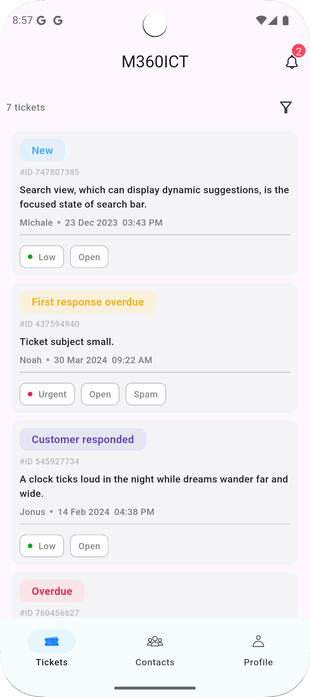 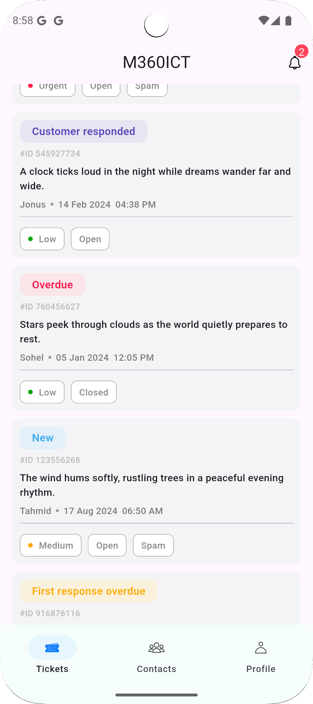

The list can be re-fetched by swiping the screen down. A shimmer loading effect is applied for the duration of the tickets asynchrounously loading.   
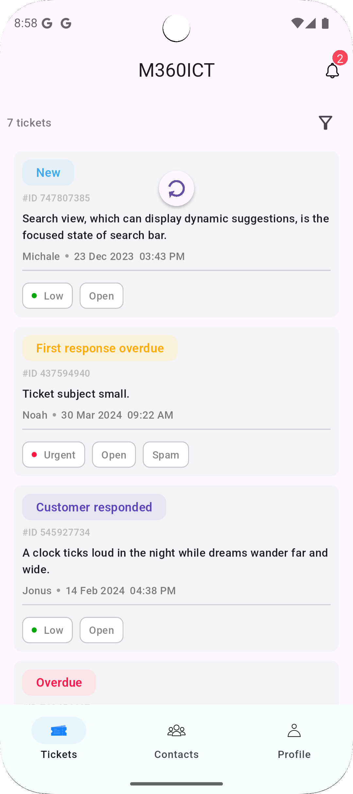 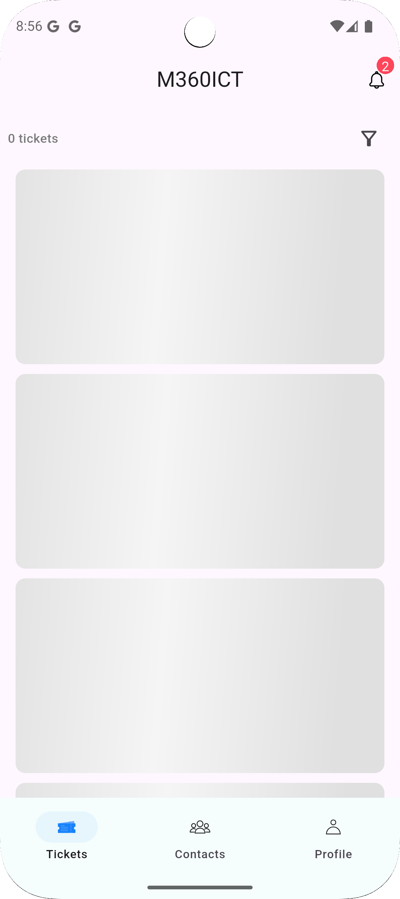

There is a filter icon at the right corner, clicking it navigates the screen to the filter screen. All the filter options are selectable. The filter status options are fetched from API and created using list. A loading animation is showed while it loads.   
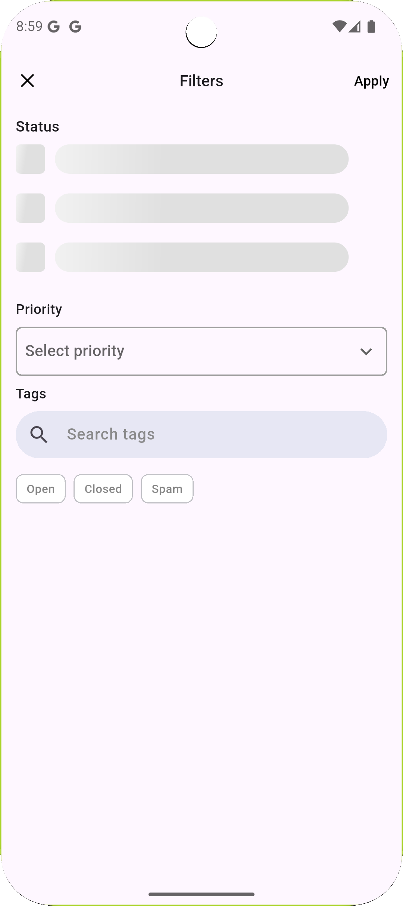 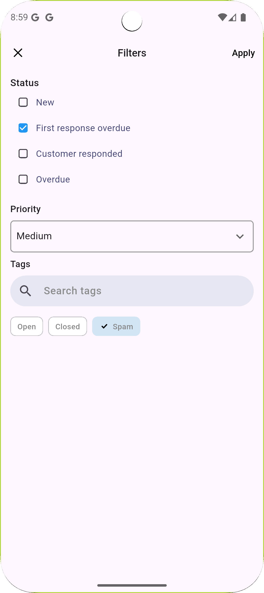

The filter options can be selected and deselected also.   
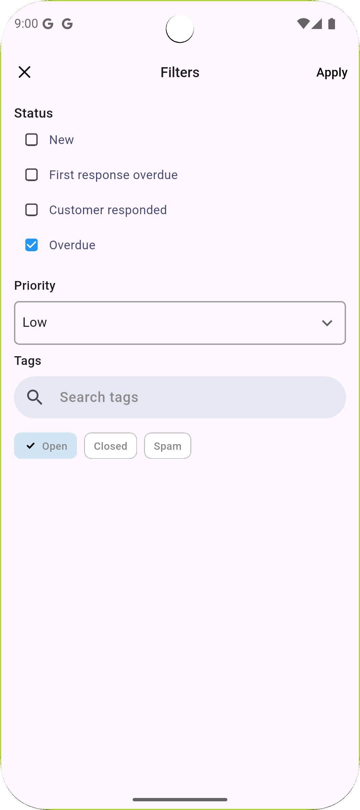 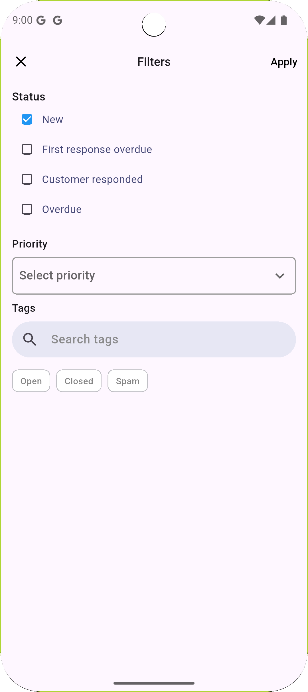

### Contacts
This screen shows a list of contacts which are also fetched from API. All the contact informations excluding the profile image is gained from API resonse. The contact informations are stored in the device using <b>Get Storage</b>. A shimmer loading effect is shown during the loading time. User can re-load the contacts by swiping down.   
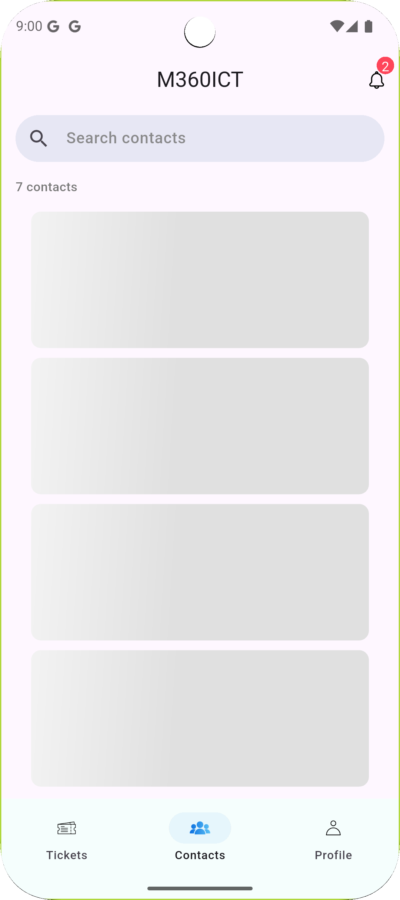 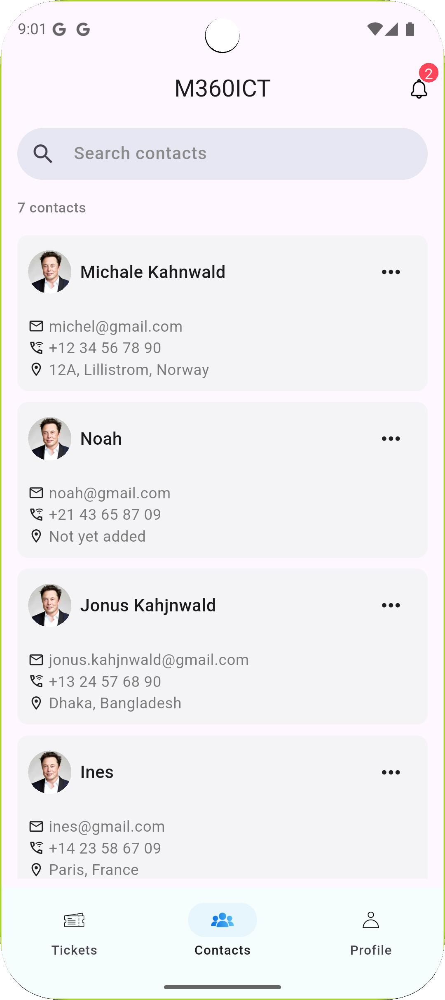 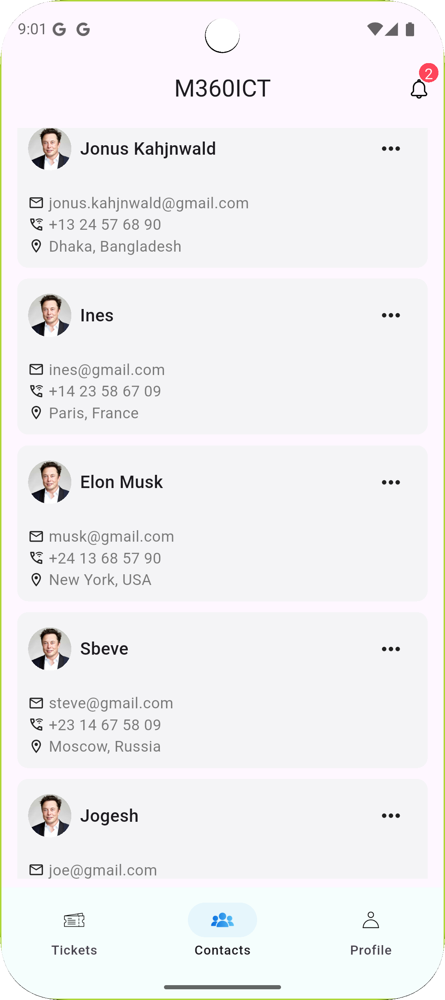

There is an options in the contact card that expands upon click. There is also active searching functionality that allows the user to search for contacts from the stored contents of the device. The contact list is re-generated upon each keystroke in the search bar.   
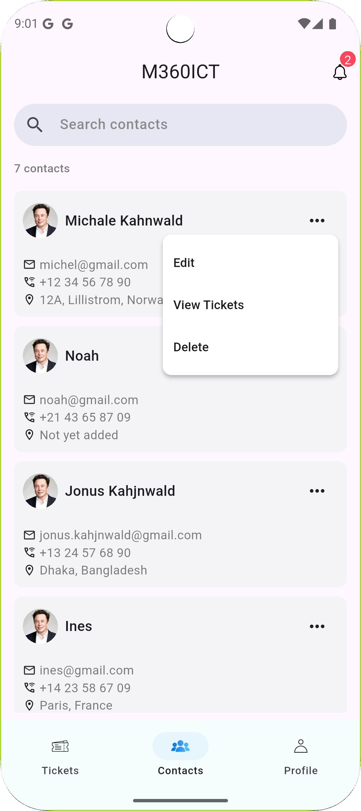 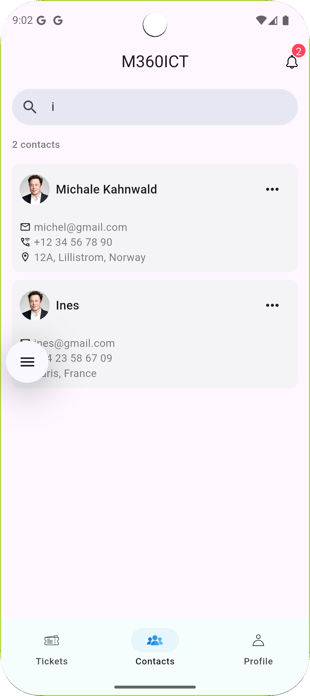

### Profile
This screen is UI only and has no dynamic functionality. It is a simple profile screen with various information.   
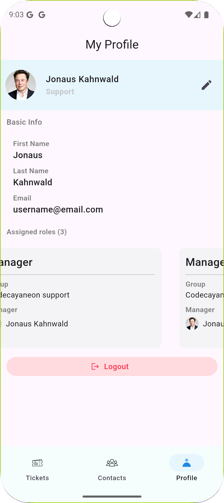

## Side features
### Network Manager
I used <b>network_manager.dart</b> that checks for internet connectivity in the app. If the device loses or regains internet connection, the app notifies the user through a toast.   
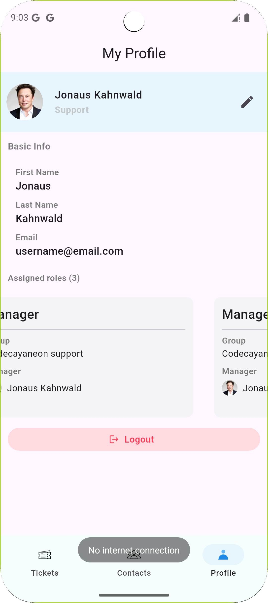 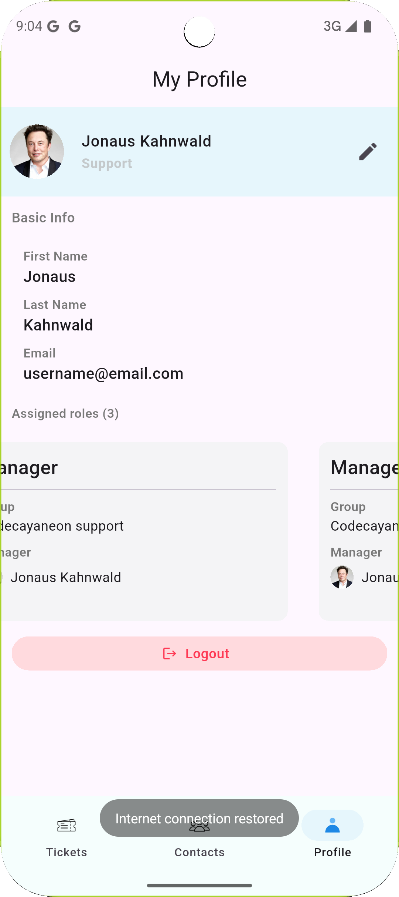  

### API Key Protection
I used <b>envied</b> and <b>envied_generator</b> packages to obfuscate the API key used in the API requests. The api key was kept in a .env variable to prevent exposing sensitive data in the app or version control.
